##  Explore Taiwan

Travel across Taiwan by region and discover the island’s most beautiful destinations

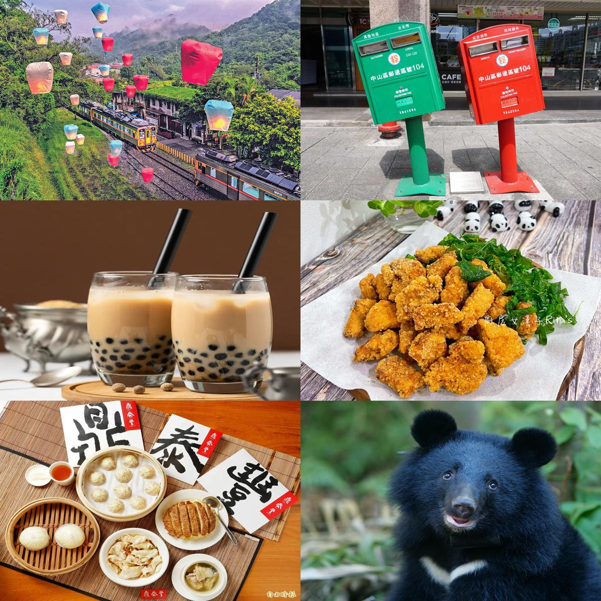

---

## North Taiwan

::: {.columns}

::: {.column width="42%"}
### Must-visit spots
- **Taipei 101**
- **Raohe Night Market**
- **Jiufen Old Street**
- **Elephant Mountain**
:::

::: {.column width="58%"}

  
  
  
  

:::

:::

---

## Central Taiwan

::: {.columns}

::: {.column width="42%"}
### Must-visit spots
- **Sun Moon Lake**
- **Qingjing Farm**
- **Alishan**
- **Gaomei Wetlands**
:::

::: {.column width="58%"}

  
  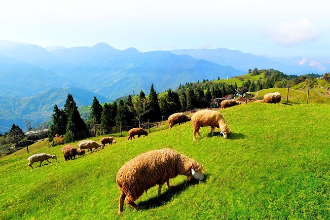
  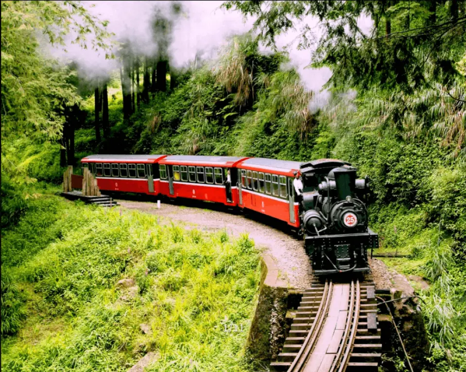
  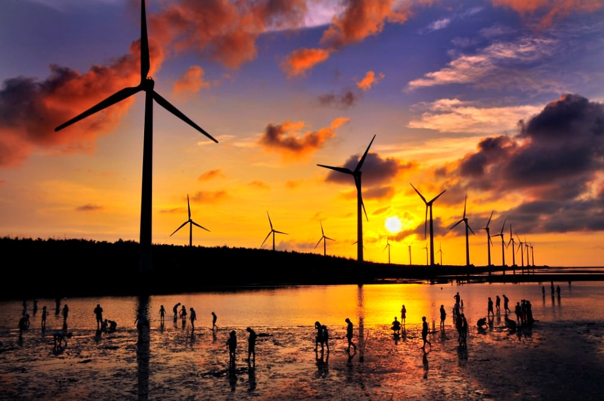

:::

:::
---

## South Taiwan

::: {.columns}

::: {.column width="42%"}
### Must-visit spots
- **Kaohsiung Harbor**
- **Liuhe Night Market**
- **Kenting Beach**
- **Anping Old Street**
:::

::: {.column width="58%"}

  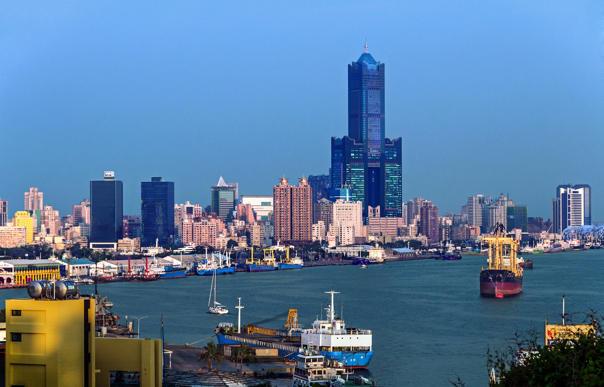
  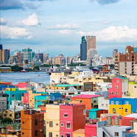
  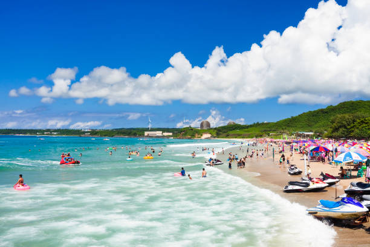
  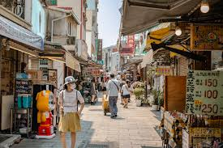

:::

:::

---

## East Taiwan

::: {.columns}

::: {.column width="42%"}
### Must-visit spots
- **Taroko Gorge**
- **Qixingtan Beach**
- **Brown Avenue**
- **Sanxiantai**
:::

::: {.column width="58%"}

  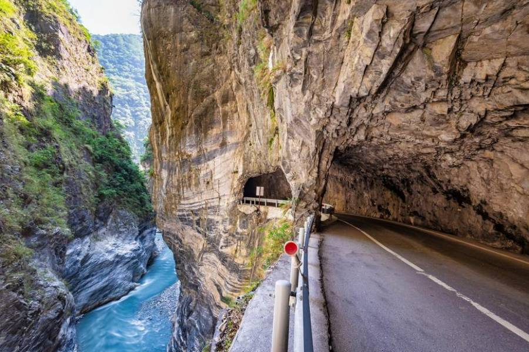
  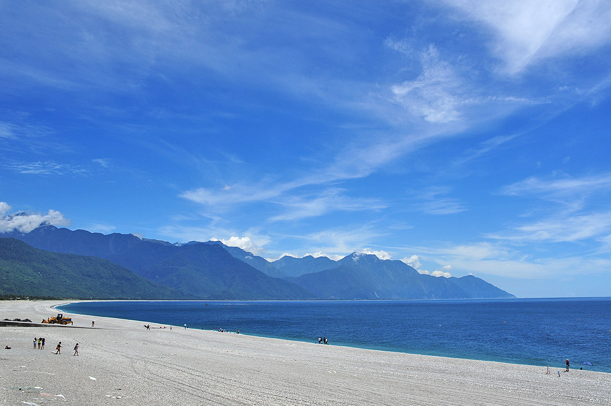
  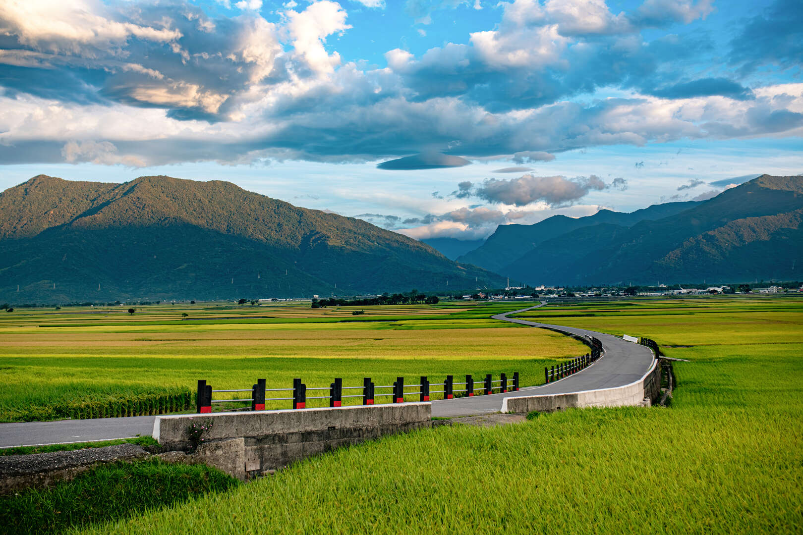
  

:::

:::

---

##  Why Visit Taiwan?

- Amazing food
- Friendly people
- Diverse landscapes

Taiwan is small but full of unforgettable experiences

  

